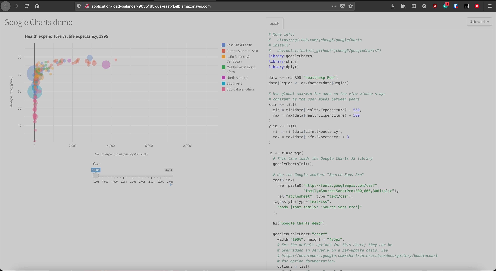

Assuming , thats the Internet is working and google is available, so, go ahead


1. Install [terraform](https://www.terraform.io/downloads.html), [aws-cli](https://aws.amazon.com/cli/), [git](https://git-scm.com/book/en/v2/Getting-Started-Installing-Git) ( installation method may vary and depend on your OS ) 
2. Get the [AWS credentials](https://docs.aws.amazon.com/general/latest/gr/aws-security-credentials.html) from your local systems engineer
3. Setup and create AWS [keys](https://docs.aws.amazon.com/cli/latest/userguide/cli-configure-files.html)
4. Create Amazon ECS task execution IAM [role](https://docs.aws.amazon.com/AmazonECS/latest/developerguide/task_execution_IAM_role.html)
5. Create [ECR repository](https://docs.aws.amazon.com/AmazonECR/latest/userguide/repository-create.html) in appropriate AZ 
6. Create and deploy ssl certificate ( if you have one ) and specify it arn as var.certifivate in Terraform variables.

7. Go to Settings - Secrets - Actions of your github repo and set the two secets - 
```
AWS_ACCESS_KEY_ID
AWS_SECRET_ACCESS_KEY
```
this is needed when you start push docker container to aws registry . Also ,dont forget to check and verify next variables in aws action 
in your Github repo - this is registry address and repo name - change it on yours!
```
ECR_REGISTRY: 465485640678.dkr.ecr.us-east-2.amazonaws.com
ECR_REPOSITORY: 182-google-charts
```

The task execution role grants the Amazon ECS container and Fargate agents permission to make AWS API calls on your behalf. 
So create task and save it [arn](https://docs.aws.amazon.com/general/latest/gr/aws-arns-and-namespaces.html) - we need it to pass to terraform variables.tf
   
6. Check the aws-cli is working
7. Clone this repo to some place
8. Look for the files and folders, if you want


Build pipeline is the next - any push to this repo starts build Docker container located in the root of repo, after build ( by Github actions ) container are pushed to AWS ECR repo, then m by API call we update the version in ECS. Very simple, but very reliable.

Before you start deploying terraform stack to AWS - check , thats the Docker image are available in repo , all variables is correct and all resources are created.

# Deploy AWS Stack to cloud

### Check all variables in [variables.tf](02-terraform/variables.tf) - Cetificate arns, regions and ECR urls. Check it twise, if you not sure :))))

Terraform stask in this example contain two parts 
* Preinstallation preparations - first of all , we need to create S3 bucket and Dynamodb locking table to handle Terraform remote state file
* This is actually main part of Code. 

## Terraform deployment step 1

To deploy AWS stack to cloud you need the next things - working AWS cloud account,terraform and this repo.Terrafoorm infrastructure creates ECS cluster with VPC and subnets, ALB with http/https endpoinds ,Postgres RDS instance and IAM roles.


to deploy "storage stack" you need to go to "[01-terraform](01-terraform)" folder and run next commands

```
terraform init
terraform plan
terraform apply
```

This will install ( create S3 bucket and Dynamodb lock table in us-east-1)
When this part is ended sucksessfuly , go to part 2

## Terraform deployment step 2

to deploy main AWS stack you need to go to  "[02-terraform](02-terraform)" folder and run next commands

```
terraform init
terraform plan
terraform apply
```
absolutely the same as a step one , but on a second step terraform will create more then 30 objects, you have to be patient.


when the apply command will apply all infrastructure changes - the output manifest will show you URL of your Load Balancer DB url , and IAM role URS, just in case. Thats all. During next 1 minute your cluster will be in operational state.
Go to ALB url and enjoy you app.

To update service in cluster, for example if you deploy new version of Docker container to registry you need to re-pull it. You may use your favorite CI/CD pipeline to push it or ran next command ( ran by hands, from cli, or from CI/CD suite )

## This is small video how it works

<a href="https://asciinema.org/a/rgRl6qRTYLCGlfwJukomAjhnn?autoplay=1"></a>


#### Cluster - name of your cluster 
#### Service - name of your service, surely 
#### Task-definition - name of task definition 
```
aws --profile default ecs update-service \
    --cluster prod \
    --service eval-dash-dev \
    --task-definition eval-dash-dev-dev-prod \
    --force-new-deployment
```

Remember - aws-cli if your best friend :)


# important note
 This is scope of manifeste was created to take the technical interview - so this is a some kind of demo version - in *full*  version you can have ( i already have it )
 
 * autoscaling of containers in ECS cluster based on Cloudwatch metrics
 * route53 custom DNS domain names for endpoint's
 * separate ecs_task_definitions ( to run more then one service per cluster)
 * ssl custom certificates for ALB 
 * ssl listener on ALB
 * Amazon EKS replacement of ECS 
    


btw, work like a charm :)


